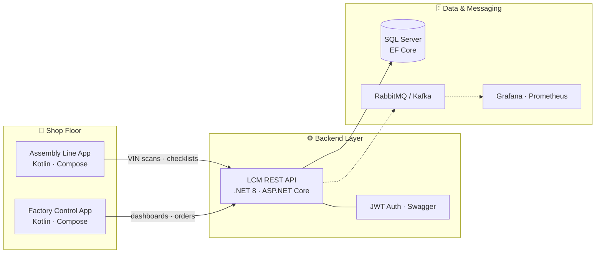

<!-- ╔══════════════════════════════════════════════════════════════════╗ -->
<!--   TIAGO SOL RIBEIRO · PROFILE README · TRACEABILITY EDITION          -->
<!--   Theme-adaptive: renders correctly on light AND dark GitHub themes  -->
<!-- ╚══════════════════════════════════════════════════════════════════╝ -->

<div align="center">


<!-- Typing banner · one variant per theme so it never disappears on white -->
<picture>
  <source media="(prefers-color-scheme: dark)" srcset="https://readme-typing-svg.demolab.com?font=JetBrains+Mono&size=22&duration=2800&pause=700&color=00E5FF&background=00000000&center=true&vCenter=true&width=820&lines=I+build+software+that+keeps+factories+traceable+%F0%9F%8F%AD;Android+apps+%2B+.NET+backends+%2B+real+production+lines;From+VIN+scans+to+live+dashboards+%E2%80%94+end+to+end;MSc+%40+UTAD+%C2%B7+Research+Fellow+%40+A-MoVeR;Status%3A+shipping+to+the+shop+floor+%F0%9F%9A%80" />
  
</picture>

<br/><br/>

<a href="https://www.linkedin.com/in/tiago-sol-ribeiro-3022b8251/"></a>
<a href="https://orcid.org/0009-0005-6559-5716"></a>
<a href="https://github.com/tiagosol04"></a>


</div>

<br/>

<!-- ════════════════ GATE 01 · IDENTIFICATION ════════════════ -->

## `[ GATE 01 ]` IDENTIFICATION — `whoami`

> Every unit on a production line passes through traceability gates before it ships.
> This README works the same way. **Welcome to mine.**

```yaml
name:        Tiago Sol Ribeiro
role:        Junior Software Developer · Research Fellow @ A-MoVeR
education:   MSc Computer Engineering @ UTAD (2025 → ...)  |  BSc Computer Engineering @ UTAD (2025)
domain:      Industrial software · Traceability · Quality control · Production monitoring
builds:      Android apps · REST APIs · Dashboards · Distributed services
languages:   PT (native) · EN (B2) · ES (B2)
```

I'm a Computer Engineering MSc student and Junior Software Developer who bridges **applied research and real industrial needs**. At **Project A-MoVeR** I develop the software that keeps a motorcycle factory connected — from the operator scanning a VIN on the assembly line, through the backend API that validates every workflow step, to the dashboard a supervisor checks in real time.

Junior in title. **Project-driven by default.**

---

<!-- ════════════════ GATE 02 · ASSEMBLY ════════════════ -->

## `[ GATE 02 ]` ASSEMBLY — the stack I build with

<table>
<tr>
<td valign="top" width="50%">

#### 📱 Mobile — where I'm strongest

     

#### ⚙️ Backend & APIs

      

</td>
<td valign="top" width="50%">

#### 🗄️ Data

    

#### 🔗 Integration & Infrastructure

      

#### 🧠 Also fluent in

    

</td>
</tr>
</table>

### 🏭 How my systems fit together

<!-- Mermaid auto-adapts to GitHub's light/dark theme — always readable -->


---

<!-- ════════════════ GATE 03 · QUALITY CONTROL ════════════════ -->

## `[ GATE 03 ]` QUALITY CONTROL — featured builds

Every project below passed through a real deadline, a real reviewer, or a real factory. ✅

<table>
<tr>
<td valign="top" width="50%">

### 🏭 [A-MoVeR · LCM Backend API](https://github.com/tiagosol04/amover-lcm-backend-api)

The central backend of a digital factory ecosystem — production orders, VIN traceability, serial-numbered parts, quality checklists, dashboards and after-sales.

`.NET 8` `ASP.NET Core` `EF Core` `SQL Server` `JWT` `Swagger`

</td>
<td valign="top" width="50%">

### 📲 [A-MoVeR · Factory Control App](https://github.com/tiagosol04/amover-factory-control-app)

Native Android app giving managers a 360° mobile view of the factory: live metrics, order pipelines, VIN history, team availability and role-based navigation.

`Kotlin` `Jetpack Compose` `Material 3` `MVVM` `Retrofit` `StateFlow`

</td>
</tr>
<tr>
<td valign="top" width="50%">

### 🔧 [A-MoVeR · Assembly Line App](https://github.com/tiagosol04/amover-assembly-line-app)

The operator's tool on the shop floor: VIN identification, serial-part registration, dynamic assembly steps, packaging checklists and final quality validation.

`Kotlin` `Jetpack Compose` `Retrofit` `MVVM` `DTOs`

</td>
<td valign="top" width="50%">

### 🛰️ [MobileUserAPI · Microservices Backend](https://github.com/tiagosol04/mobileuserapi-microservices-backend)

.NET microservices for a mobility ecosystem — users, vehicles, telemetry, trips, charging and faults — behind a gateway/BFF with gRPC over HTTP/2.

`.NET 8` `gRPC` `Protobuf` `JWT` `Microservices`

</td>
</tr>
<tr>
<td valign="top" width="50%">

### 🌊 [AquaSense · Distributed Monitoring](https://github.com/tiagosol04/aquasense-distributed-monitoring)

A full sensor-data pipeline: simulation → async publishing via RabbitMQ → gRPC preprocessing → validation → REST API → live web dashboard.

`C#` `.NET` `RabbitMQ` `gRPC` `ASP.NET MVC` `Python`

</td>
<td valign="top" width="50%">

### ⚡ [BetStrike · Event-Driven Platform](https://github.com/tiagosol04/betstrike-event-driven-platform)

Event-driven integration platform simulating a betting ecosystem: Kafka streaming, RabbitMQ workers, Docker Compose orchestration and full observability.

`Kafka` `RabbitMQ` `Docker` `SQL Server` `Prometheus` `Grafana`

</td>
</tr>
</table>

---

<!-- ════════════════ GATE 04 · TELEMETRY ════════════════ -->

## `[ GATE 04 ]` TELEMETRY — live metrics

<div align="center">

<!-- Stats cards · light + dark variants -->
<picture>
  <source media="(prefers-color-scheme: dark)" srcset="https://github-readme-stats.vercel.app/api?username=tiagosol04&show_icons=true&theme=github_dark&hide_border=true&bg_color=00000000&title_color=00e5ff&icon_color=00b4d8&text_color=c9d1d9" />
  
</picture>
<picture>
  <source media="(prefers-color-scheme: dark)" srcset="https://github-readme-stats.vercel.app/api/top-langs/?username=tiagosol04&layout=compact&theme=github_dark&hide_border=true&bg_color=00000000&title_color=00e5ff&text_color=c9d1d9" />
  
</picture>

<br/><br/>

<!-- Contribution snake · light + dark variants -->
<picture>
  <source media="(prefers-color-scheme: dark)" srcset="https://raw.githubusercontent.com/tiagosol04/tiagosol04/output/github-contribution-grid-snake-dark.svg" />
  
</picture>

</div>

---

<!-- ════════════════ GATE 05 · BEYOND ════════════════ -->

## `[ GATE 05 ]` BEYOND THE TERMINAL

<table>
<tr>
<td align="center" width="33%" valign="top">

### 🤝
**PEOPLE OPS**

Sales Assistant @ SportZone

<sub>*handling people under pressure<br/>is a feature, not a bug*</sub>

</td>
<td align="center" width="33%" valign="top">

### 🌍
**COMMUNITY**

ReFood · Vila Real Athletics

<sub>*the best commits also<br/>happen offline*</sub>

</td>
<td align="center" width="33%" valign="top">

### 📚
**LEVELING UP**

AI · Data Analysis · Systems Integration

<sub>*the MSc XP bar<br/>never stops filling*</sub>

</td>
</tr>
</table>

---

<!-- ════════════════ EXPEDITION ════════════════ -->

<div align="center">

## `[ ✅ ALL GATES PASSED ]` READY FOR EXPEDITION

**Open to:** junior software developer · backend · Android · systems integration roles
*recruiters welcome — formal attire compiles on demand* 👔

<br/>


</div>
